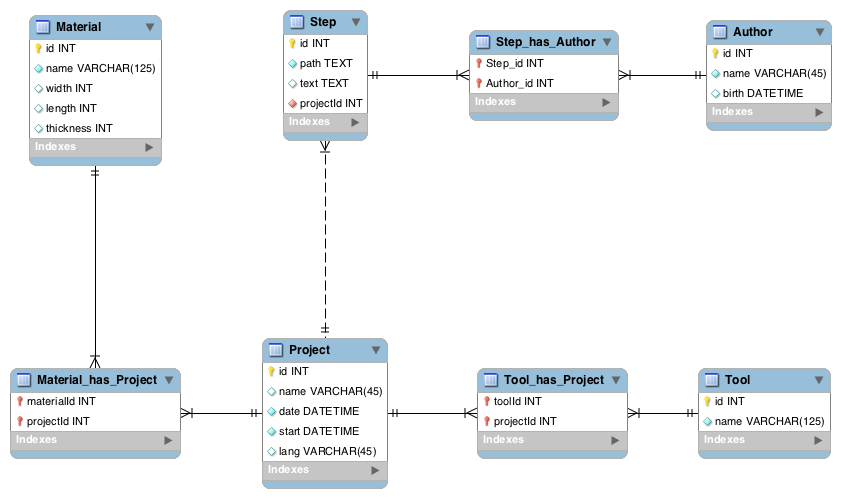

#Documathon
---

##Introduction
###Présentation
Au Faclab, Fablab de l'Université de Cergy-Pontoise à Gennevilliers, le lieu est ouvert à tous, pour peu que l'utilisateur prenne la peine de documenter. Seulement, documenter nécessite la maitrise d'un ordinateur, une aisance à la lecture, ainsi que la capacité de traduire par écrit ce que l'on souhaite partager.

On en arrive donc à la conclusion que le Faclab n'est pas ouvert à tous, car il impose une condition d'entrée qui ne peut être satisfaite par tous.

Le Documathon est un projet qui cherche à répondre à cette question en apportant un moyen simple de documenter.

###Principe de base
Le premier principe du documathon est de pouvoir documenter en se passant au maximum du clavier, sans l'interdire.

Pour cela, l'utilisateur pourra documenter son projet à l'aide de photo. Et à chaque photo qui sera prise, il aura la possibilité, s'il le souhaite, d'ajouter du texte explicatif.

Pour prendre ses photos, l'utilisateur utilisera une boîte qui comporte plusieurs boutons, permettant de passer à l'étape suivante, d'annuler ou de partager le projet. Cette boîte sera reliée à un écran.

C'est donc *"juste"* cela, le Documathon. Un boîte avec des bouton qui permet de prendre des photos.

###Architecture du projet
Le projet est divisé en plusieurs parties, elles même à nouveau divisables en sous parties. Et ainsi de suite.

	.
	├── doc
	├── interface
	├── hooks
	└── object
	    ├── arduino
	    │   └── searchs
	    │       ├── box
	    │       ├── multiplexeur
	    │       └── nfc
	    ├── box
	    └── rasp
On trouve dans **doc** toute la documentation des projets. On la retrouve néanmoins dans chaque partie dans les **README**.

Dans **interface** se trouve tout le code lié à ce que vera l'utilisateur à l'écran quand il documentera le projet.

Dans **object** se trouve tout ce qui est lié à l'objet physique. On y retrouve les recherches et les codes arduino, tout ce qui est lié à la boîte et tout ce qui concerne le Raspberry Pie.

**hooks** est un dossier à part. On y liste les hooks qui permettent de simplifier la production sur le projet. Par exemple, pre-commit est appellé juste avant chaque commit. On y recompile la documentation qui se trouve dans doc, afin qu'elle soit à jour dès que l'on change l'un des fichiers README référencés comme faisant partie de la documentation.

##L'objet

###V0.1

####Conception

#####L'exterrieur
Le documathon est une boite de 25cm sur 35cm, épaisse de 6 centimètres.

La boîte a été réalisé grâce au générateur de la cité des science, en précisant les tailles des encoches sur les côtés.

Sur les planches de la boîte, on a rajouté des trous pour les sorties suivante:
* Sortie HDMI
* Sortie usb
* Sortie d'alimentation pour le Raspberry Pie

Il y a également la place sur la planche du dessus pour les quatres leds et les six boutons.

#####L'intérrieur
La raspberry Pie et le hub usb sont maintenues par des cales triangulaires. Il est possible de retirer les deux modules facilement.

Les 3 gros boutons sont soudés sur des plaques de plexiglasse, eux même maintenus à la plaque du dessus.

On trouve également dans la boîte la carte arduino, la carte nfc, deux breadbord et beaucoup de fils. Tout cela n'est pas maintenu pour l'instant.

####A prendre en compte pour la V1

* La carte Arduino sera branchée sur le Raspberry, mais une sortie pour faire passer un cable supplémentaire pourrait être utile.
* Remonter la sortie usb, conçu à l'envers.
* Remplacer les boutons de partage par des switch
* Faire la boite en plexi?

Le matériel suivant a été commandé pour réaliser une meilleur boite
* Pushbutton métalique. Ce bouton rond permettra de remplacer un couple bouton/led pour le partage. Il a l'avantage de pouvoir être maintenu facilement au moyen d'un écrou et d'être éclairé.
* Une grande breadboard, pour pouvoir faire tous les branchements au même endroit.
* Plusieurs puces RFID, au format carte et tag.
* Des fils pour relier le bouton à la carte.

##La boîte
Les fichiers de ce dossier son préfixé par la version de la boîte dessinée.
###V0.1
* Box : Il s'agit de tous les côtés de la boites et des cales nécessaires à tenir le Rasp et le hub usb dans la boite.
* Box - Part 1 & 2 : Le fichier original de la boite est conçu sur une planche plus grande que celles disponnibles au Faclab. Ces deux fichiers sont réorganisés de façon à tennir sur des planche de 60x40cm
* Button fix : Les boutons doivent être soudé afin d'être maintenus et reliés à la carte arduino. Il s'agit ici du modèle de l'écartement des pattes.
* Cales et boutons : Ce sont les cales à mettre entre la planche du dessus et les boutons.

##Arduino
Il y a plusieurs dossiers dans ce dossier.

* **searchs** contient toutes les recherches sur le code Arduino. 
* **src** contient le projet en lui même

###Les recherches
Pour arrivé au premier prototype, il faut tester plusieurs fonctionnalités. D'où la nécessité de garder une trace de ces essais, que l'on regroupe dans le dossier *recherche*

On y trouve un dossier par essai.

* Box : Il s'agit de l'essai permettant de faire clignotter les leds à l'appui sur les boutons
* Nfc : C'est le code de base qui réagit au passage d'un tag
* Multiplexeur: Il s'agit des tests sur le multiplexeur afin de brancher sur la carte arduino le shield nfc et l'ensemble led/bouton.

##Raspberry Pi

Le Raspberry est une carte, un peu plus grande qu'une carte de crédit, offrant toutes les possibilités d'un ordinateur. Celui utilisé dans le projet est un Raspberry model B. Il possède deux ports USB et un port ethernet.

###Installation de l'OS
La première étape est d'installer un OS (Opérating système). La documentation de Raspberry [explique bien comment faire](http://www.raspberrypi.org/downloads/).

Pour le projet du Documathon, j'ai installé une distribution Debian, la Raspbian. L'avantage de cette distribution est qu'elle est basée sur Debian. Il s'agit d'un enrironnement qui est souvent utilisé sur les serveurs. C'est une distribution connue et donc sur laquelle on a de grandes chances de retrouver ses marques.

####Mise à jour
On notera qu'une fois l'installation terminée, il convient de mettre à jour l'OS.

	$ sudo apt-get update
	$ sudo apt-get upgrade
	$ sudo apt-get dist-upgrade	
	
####Installations basiques
Pour pouvoir travailler sur le Raspberry Pi, j'ai installé les application suivante:
	
	$ sudo apt-get install vim
	
**Vim** est un éditeur en console. Il existe également nano. C'est ensuite une question de préférence.

	$ sudo apt-get install iceweasel
	
**Iceweasel** est une version de firefox pour Debian.

	$ wget http://node-arm.herokuapp.com/node_latest_armhf.deb
	$ sudo dpkg -i node_latest_armhf.deb
	$ npm install websocket

**Node Js** sera utilisé dans la suite du projet. I est conseillé de l'intallé tout de suite.

###Installation des composants
Il va y avoir plusieurs composants qui tourneront sur le Raspberry. Chacun d'entre eux nécessite une installation plus ou moins difficile.

####La clé wifi
Certaines clés wifi fonctionnent du premier coup. D'autre fonctionnaient du premier coup. C'est le cas de la [TP-Link WN725N](http://www.amazon.fr/gp/product/B008B7PZU4/ref=oh_aui_detailpage_o04_s01?ie=UTF8&psc=1). Elle est relativement peu chère, ce qui en fait la parfaite candidate pour un Raspberry Pie.

J'ai suivit [ce tutoriel](http://www.raspberrypi.org/forums/viewtopic.php?p=462982) pour la faire fonctionner. Voici ce qui a fonctionné pour moi.

	$ uname -a
		Linux raspberrypi 3.12.22+ #691 PREEMPT [...]
	$ wget https://dl.dropboxusercontent.com/u/80256631/8188eu-20140616.tar.gz
	$ sudo install -p -m 644 8188eu.ko /lib/modules/$(uname -r)/kernel/drivers/net/wireless
	$ sudo insmod /lib/modules/$(uname -r)/kernel/drivers/net/wireless/8188eu.ko
	$ sudo depmod -a
	
Suite à celui, la clé fonctionne. Il ne reste plus qu'à configurer le wifi. Et comme conseillé [ici](http://www.framboise314.fr/la-framboise-314-et-le-wifi-ou-comment-se-passer-du-cable-ethernet-avec-le-raspberry-pi/), j'ai installé le soft **wicd**

	$ sudo apt-get install wicd
	
Une fois l'application installée, elle est accessible graphiquement dans Menu | Internet | Wicd. Il faut trouver le réseau auquel se connecter, entre le mot de pass et le type de mot de passe. Et la clé fonctionne.

####La webcam
La webcam [Trust Spotlight](http://www.amazon.fr/gp/product/B0028YR4DW/ref=oh_aui_detailpage_o03_s01?ie=UTF8&psc=1) est une caméra qui est reconnu automatiquement sur Rasbian.

Comme la webcam sera utilisée sur le web, grâce au webRTC, la meilleur façon de tester si elle fonctionne est de faire le test en ligne.

Pour cela, il faut démarer **Iceweaseal** et lancer la page suivante: [https://mozilla.github.io/webrtc-landing/]()

Il s'agit d'exemple de l'utilisation de WebRTC sur Firefox. **getUserMedia example** fait un très bon test.

####Arduino
#####Le code de teste
Pour tester la communication d'Arduino vers le port série, j'ai chargé un skecth Blink légèrement modifié:

	void setup() {
	  // initialize digital pin 13 as an output.
	  pinMode(13, OUTPUT);
	  // initialize the serial port
	  Serial.begin(9600);
	}

	// the loop function runs over and over again forever
	void loop() {
	  digitalWrite(13, HIGH);   // turn the LED on (HIGH is the voltage level)
	  Serial.write("Something");// Write something on the serial port
	  delay(1000);              // wait for a second
	  digitalWrite(13, LOW);    // turn the LED off by making the voltage LOW
	  delay(1000);              // wait for a second
	}
	
Une fois le sketch uploadé sur arduino, brancher la carte sur le Raspberry Pi, en USB. Puis redémarrer le petit ordinateur

	$ sudo reboot

#####La configuration du port série
La carte Arduino va devoir communiquer avec le Raspberry Pi sur le Port Serie. Pour cela, il faut commencer par installer arduino.

	$ sudo apt-get install arduino
	
Ensuite, il faut configurer le port série pour lire ce qu'il s'y affiche. Pour cela, minicom est un outils très pratique.

	$ sudo apt-get install minicom
	
Une fois minicom installé, il faut repérer le port sur lequel communique la carte arduino. Car le Raspberry n'a pas de ports séries. Seulement des ports usb.

	$ dmesg | grep tty
	
Cette commande affiche les sorties comprenant *tty*. Après avoir repéré le port qui émule le port série, dans mon cas **ttyUSB0**, il faut renseigner le port série.

	$ sudo apt-get install setserial
	$ setserial -g /dev/ttyUSB0
	
Puis on peut démarer minicom

	$ sudo minicom -s

Sélectionner **Serial port setup**. Taper **a**, puis écrire **/dev/ttyUSB0** (Dans mon cas). Puis taper entrer.

Le port série est réglé. Reste la définition de ce que l'on envoie sur le port série. Sur Arduino, je définie le porte série sur **9600**. Pour le configurer, taper sur **E**, puis **C**, qui indique 9600. Puis presser entrer.

Appuyer sur echap, puis sélectionner **Save setup as dfl**. Attention, il est possible de sauvegarder cette configuration par défaut uniquement si minicom a été lancé en root. D'où l'utilisation de *sudo* devant la commande.

Sélectionner exit. ET on arrive sur la lecture du port série.

Si **Something** s'écrit en boucle sur l'écran, c'est que la carte arduino communique sur le port série.

Pour quitter minicom, faire Ctrl+A X.

##Interface

###Modèle de données
Que ce soit sur le serveur ou sur l'interface client proposée ici, on retrouve le même modèle de données. Celui-ci est relativement simple

###Client

####testJS
Le dossier **testJS** est un test de la lecture sur le port série grâce à Nodejs. Pour cela il faut installer le module serialport

	$ npm install serialport
	
Il faut ensuite renseigner, dans *server.js*, les informations sur le port. Ici, on a testé sur le port **/dev/tty.usbserial-A600eo9b**.

Voici le sketch Arduino envoyé sur la carte:

	void setup() {
	  Serial.begin(9600);
	}

	void loop() {
	  Serial.println("Une ligne");
	  delay(1000);
	}
	
Il faut donc également renseigner le *baudrate*. Ici, **9600**.

Une fois le fichier *server.js* configuré, et la carte Arduino branchée, il faut lancer la comander suivante:

	$ node server.js
	
Cela sert à lancer le script js. On obtient alors la sortie suivante:

	$ node server.js 
		open
		data received: Une ligne
		data received: Une ligne
		data received: Une ligne
		data received: Une ligne
		
Il faut faire Ctrl+C pour arrêter le script.

####testUIJS
Ce dossier est un test de lecture sur le port série avec interaction au niveau d'une interface web. Pour faire fonctionner cet exemple, il faut installer plusieurs modules:

	$ npm install serialport
	$ npm install socket.io

Voici le sketch Arduino envoyé sur la carte:

	int i = 0;

	void setup() {
	  Serial.begin(9600);
	}

	void loop() {
	  Serial.println(0x0100);
	  digitalWrite(13, HIGH);
	  delay(3000);              
	  Serial.println(0x0101);
	  digitalWrite(13, LOW);    
	  delay(3000);              
	}

L'envoi de commande en hexadécimale est destiné à vérifier que cela fonctionne bien pour réaliser le protocole de communication entre le Raspberry et la carte Arduino.

Il faut ensuite démarrer le server:

	$ node server.js 
	
Puis se rendre sur l'adresse **localhost:8080**. Il ne faut pas oublier de préciser le *port* et le *baudrate*, comme dans l'exemple ci-dessus.

##Server

La partie serveur est la gestion de tout ce qui est en ligne.

Cette partie est nomée serveur, car il permettra, à terme, de stocker au même endroit tous les projets des labs. C'est pourquoi il y a une api qui permet d'y accéder.

D'une manière générale, on retrouve dans chaque réponse de l'API les champs suivants:
* **datas** Il peut s'agir de n'importe quel type de données. C'est ici que l'on récupère les données que l'on souhaitait récupérer grâce à l'API.
* **status** Il s'agit du code du status de réponse de la requête
* **error** Cela précise si on a récupéré une erreur ou un succes
* **msg** Le message permet d'ajouter des information sur la réponse, que ce soit sur le type d'erreur rencontré ou sur l'état des données.

Une version de l'api se trouve à [cette adresse](http://api.documathon.tgrange.com/)

Voici le protocole de l'API:

###/projects
Cette route affiche tous les projets dans datas

###/projects/:id
Cette route retourne un projet en particulier. Id est l'identifiant du projet en base.

###/projects/date/:date
Cette route retourne tous les projets après la date indiquée

###/projects/create/:folderName
Cette route permet d'enregistrer un projet. Il faut donner le nom du dossier où se trouve le projet et l'API se charge de l'entrer en base de donnée. Ainsi, le serveur garde la main sur la base de données, tout en permettant à n'importe quel client d'ajouter des projets Documathon.

###Les Autres routes
####/projects/create
Cette route ne donne rien, mais précise à l'utilisateur qu'il se trompe dans l'utilisation de la fonction. Il retourne une erreur de type *4201*

La route retourn le json suivant:

	{
		"datas": {
			"/projects/create/:folderName": "Create a new project in database, with de folder pass in argument"
		},
		"status": 4201,
		"error": true,
		"msg": "ERROR | This is not the correct use of this route. Please use this"
	}

####Not Found
Si la route n'existe pas, elle renvoie un json de status *404*:

	{
		"datas": {
			"/projects": "Show all projects",
			"/projects/:id": "Show One project",
			"/projects/create/:folderName": "Create a new project in database, with de folder pass in argument"
			"/projects/date/:date": "Return all project after the date pass in argument"
		},
		"status": 404,
		"error": true,
		"msg": "ERROR | This route dosn't exist. Please try one of them."
	}

###Listing des status
* **200** : Tout est bon
* **404** : La route n'existe pas
* **4201**: Il manque le nom du dossier permettant la création d'un projet
* **4202**: Aucun projet ne possède l'id demandé.
* **4203**: Aucun projet n'a été enrengistré depuis la date indiquée.

###Technologie
L'API est basée sur le micro-framework **Slim Framework**

[http://www.slimframework.com/]()

