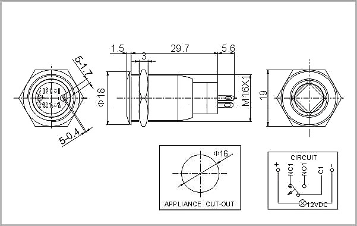
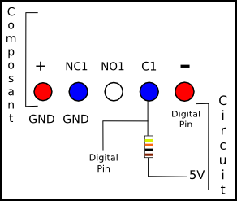

##Arduino
Il y a plusieurs dossiers dans ce dossier.

* **searchs** contient toutes les recherches sur le code Arduino. 
* **src** contient le projet en lui même

###Les recherches
Pour arrivé au premier prototype, il faut tester plusieurs fonctionnalités. D'où la nécessité de garder une trace de ces essais, que l'on regroupe dans le dossier *recherche*

On y trouve un dossier par essai.

* Box : Il s'agit de l'essai permettant de faire clignotter les leds à l'appui sur les boutons
* Nfc : C'est le code de base qui réagit au passage d'un tag
* Multiplexeur: Il s'agit des tests sur le multiplexeur afin de brancher sur la carte arduino le shield nfc et l'ensemble led/bouton.

####V0.2
La V0.2 du documathon utilise des boutons/led.

Afin d'être utilisés correctements, plusieurs tests ont été effectué, notemment à propos des branchement. 

Voici le shéma fonctionnel du composant:

Le composant est à brancher ainsi

###Protocole
Le protocole applicatif permet de définir l’organisation des données envoyées entre la carte Arduino et le Raspberry Pi. Il est très important que ce protocole soit clairement défini afin qu’il ne puisse y avoir aucune ambiguïté dans les instructions données.

Chaque donnée qui transitera entre les deux carte sera défini comme suit :

	Instruction | Donnée relative à l'instruction
	
####Les instructions
Habituellement, les protocoles sont définis en hexadécimal. Afin que le projet reste lisible, on foncionnera par mots clés de 3 caractères.
#####log
*Instruction d'identification* Cette instruction est suivit de l'id du badge nfc qui sert à s'identifier. Par exemple

	log426422

#####prj
*Instruction de projet* Permet d'identifier sur quel projet on travail. Que ce soit un nouveau projet ou non. Cette instruction est suivit de l'id du badge nfc qui sert à identifier le projet. Par exemple

	prj133789

#####btn
Cette instruction signifie que l'on a appuyé sur un des boutons de navigation. Elle est suivit d'une seconde instruction
* **can** Annuler
* **top** Flèche du haut
* **bot** Flèche du bas
* **val** Valider

Ainsi, quand l'utilisateur cliquera sur le bouton annuler, la carte Arduino envera

	btncan
	
#####shr
Cette instruction signifie que l'on a appuyé sur *share*. Elle est suivit des instructions des plateformes sur lesquels l'utilisateur souhaite partager

* **twi** pour twitter
* **fac** pour facebook

Ainsi, si quelqu'un a choisit de partager le projet sur twitter mais pas sur facebook, on obtient

	shrtwi
	
Rien n'empèche de ne pas spécifier de site de partage. Par défaut, le projet est envoyé sur le serveur commun à tous les projets et sur la wordpress du faclab. Cela permet d'avoir un lien à partager.

